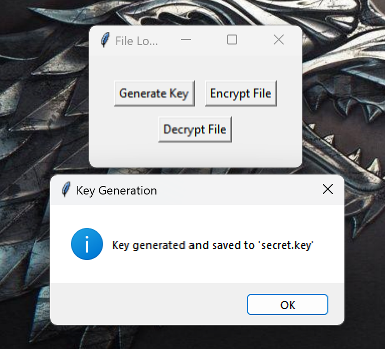
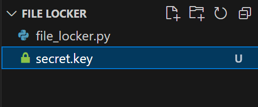
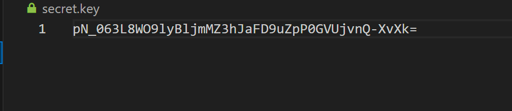
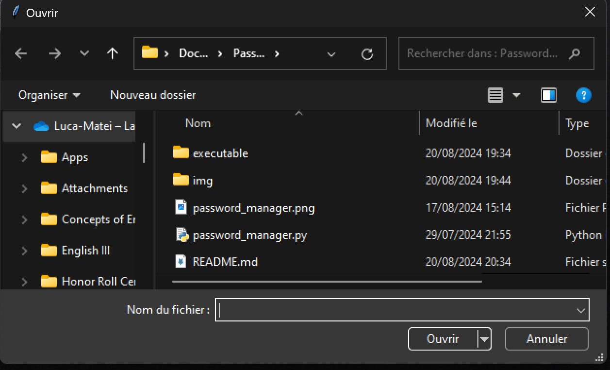
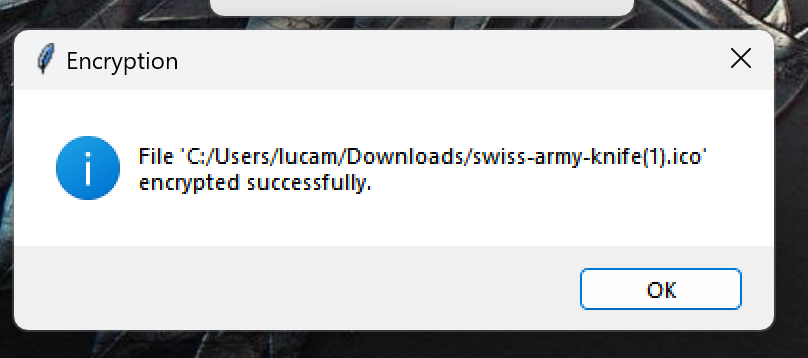
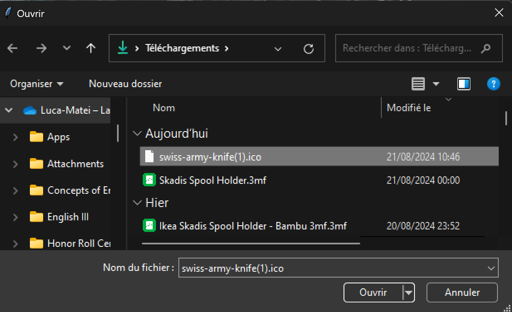
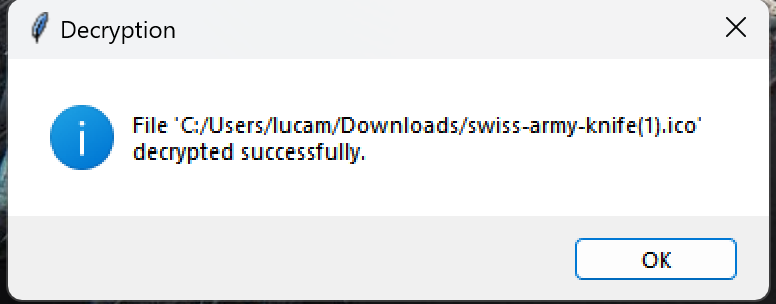

  

# About this project
File Locker is a Python file encryption app that helps you store precious documents locally without them being tampered with. 
This app uses the encryption library to encrypt files, the encryption being based on an encrypted key stored locally too.

# How to use it 

  

 
This is the main page you get after executing the app; you have three buttons from which you can choose. The first thing to do is to set the key. For this, click on the "Generate Key" button   
  

    
  

   
  You will get this message. The key has been saved to the secret.key file in the root directory of the app. It will look like this:  
  

    
     
  

    

    
  

  
    Back on the main page, you can now proceed to lock your first file. Click on "Encrypt File". You will get this:   

  

    

    
  

   
  Choose your file and click on open. You will then get this message:    

    

    
  

   
To decrypt a file you previously encrypted with this app, click on the "Decrypt File" button. This will open:

  

    
  

   
  Choose your file and then click "Open". You will get this message:
  

    
  

   
    
  # How to download
  [You can get the installer from here,](executable/File_Locker_Installer.exe)
